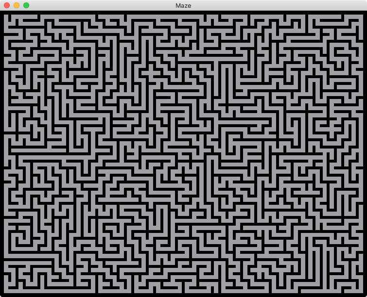
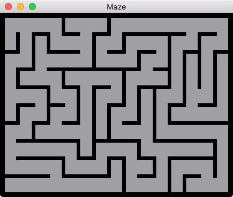
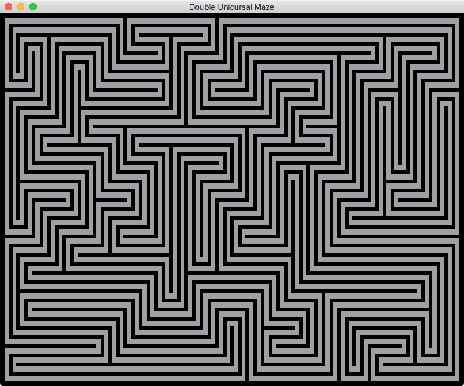
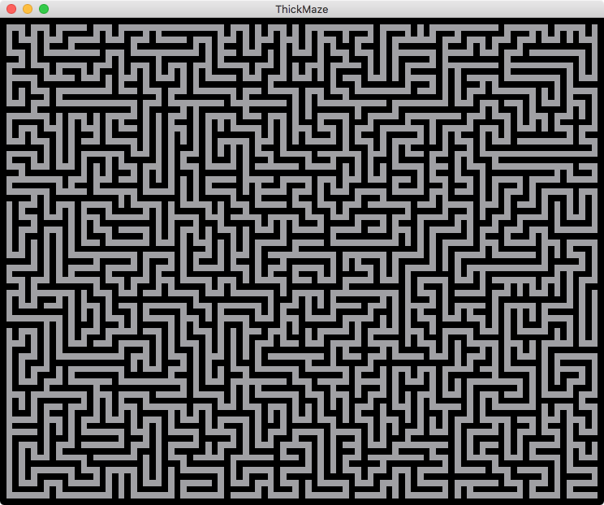
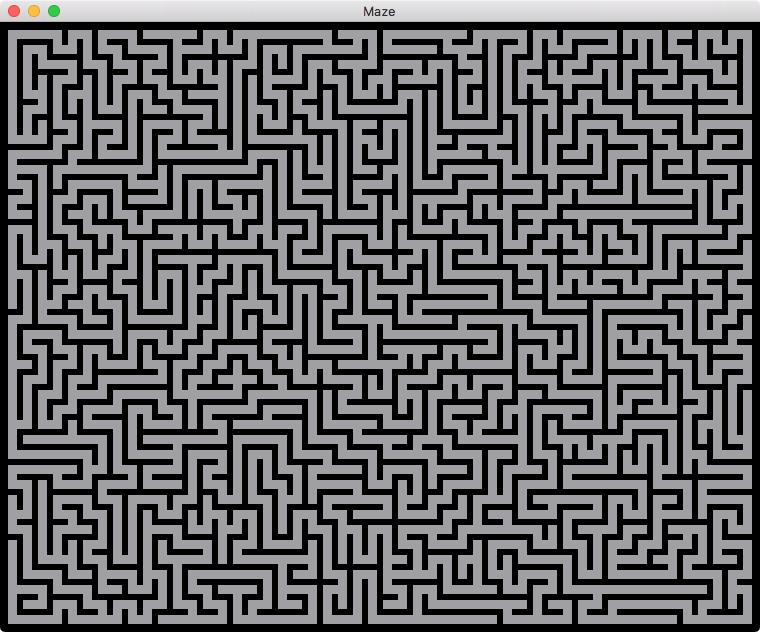
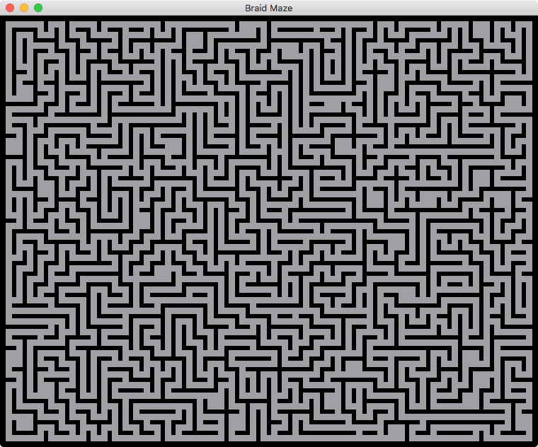

# spelunker

Current status:

[](https://travis-ci.com/sraaphorst/spelunker)

`spelunker` is a work-in-progress C++17 library for generating and solving different types of mazes:

1. [Mazes](#mazes)
2. [Unicursal mazes (aka labyrinths)](#unicursal-mazes)
3. [Thick mazes](#thick-mazes)
4. [Braid mazes](#braid-mazes)

Other subjects of interest:

1. The library offers a number of [typeclasses](#typeclasses), such as `Show` and `Homomorphism`.
2. [Here are the requirements](#requirements) to compile `spelunker`.
3. Lists (possibly incomplete) of intended future work can be found [here](#future-work) and, with more detail, in the [issues](https://github.com/sraaphorst/spelunker/issues) section.
4. [References](#references)

If you have any interest in contributing to `spelunker`, please contact me at srcoding@gmail.com.

# Mazes

A `Maze`, in spelunker, is a grid of width `w` and height `h` of cells, where walls are represented as lines between cells.

In addition to `Maze`, spelunker offers a `GraphMaze`, which is a generalization of a `Maze`.

1. [maze](src/maze/README.md): An internal representation where a cell `(x,y)` and a cardinal direction `d` are mapped to walls, and those walls are either recorded to be present or absent.

2. [graphmaze](src/graphmaze/README.md): A purely graph-theoretic representation of mazes using the [Boost.Graph](https://www.boost.org/doc/libs/1_67_0/libs/graph/doc/index.html) library.

Here is an example of a width 50, height 40 maze generated by the randomized DFS algorithm:



## Maze Generation Algorithms

Right now, the `Maze` library can generate perfect mazes using the following 12 algorithms. Further details on any algorithm are available via the link. If you know of any other algorithms for grid mazes, please contact me at srcoding@gmail.com

1. [Aldous-Broder Algorithm](src/maze/README.md#aldous-broder-algorithm)

2. [Random Binary Tree](src/maze/README.md#random-binary-tree)

3. [Randomized Breadth-First Search](src/maze/README.md#randomized-breadth-first-search)

4. [Randomized Depth-First Search](src/maze/README.md#randomized-depth-first-search)

5. [Eller's Algorithm](src/maze/README.md#ellers-algorithm)

6. [Hunt-and-Kill](src/maze/README.md#hunt-and-kill)

7. [Randomized Kruskal's Algorithm](src/maze/README.md#randomized-kruskals-algorithm)

8. [Randomized Prim's Wall Algorithm](src/maze/README.md#randomized-prims-wall-algorithm)

9. [Randomized Prim's Cell Algorithm](src/maze/README.md#randomized-prims-cell-algorithm)

10. [Recursive Division](src/maze/README.md#recursive-division)

11. [Sidewinder Algorithm](src/maze/README.md#sidewinder-algorithm)

12. [Wilson's Algorithm](src/maze/README.md#wilsons-algorithm)


# Unicursal Mazes

Furthermore, mazes can be used to construct _unicursal mazes_ - more commonly known as labyrinths - which are mazes without branches, i.e. one long, twisting passageway.

Via a simple transformation of bisecting all passages, a `w` by `h` maze will generate a `2w` by `2h` unicursal maze.

Here is a 15 x 10 maze created with randomized depth-first search:



Here is its 30 x 20 unicursalization, which we get from bisecting the passages:


And here is a unicursalization of the unicursalization, resulting in a labyrinth of size 60 x 40:



# Thick Mazes

A `ThickMaze` is a maze where the walls are not simply cell dividers, but actually take up a cell themselves, i.e. each entry in the `ThickMaze` is either `FLOOR` or `WALL`. Detailed notes about thick mazes and generation algorithms are available [here](src/thickmaze/README.md).

Here is an example of a 50 by 40 thick maze:



`ThickMaze`s can be generated using any of the standard `Maze` generation algorithms through a _homomorphism_ (see [typeclasses](#typeclasses) below for more information), and additionally, the following algorithms can be used to uniquely generate `ThickMaze`s:

1. [Cellular Automata](src/thickmaze/README.md#cellular-automata)

2. [Grid Colourings](src/thickmaze/README.md#grid-colourings)

# Braid Mazes

Most of the algorithms in this library produce _perfect mazes_, i.e. mazes where given any two points in the maze, there is exactly one path between them (without retracing your steps). These mazes are mathematically interesting, because they are called _trees_, and are a well-studied area of graph theory, which is why there are many algorithms to construct them.

Perfect mazes, however, are generally easier to solve than non-perfect mazes, which are mazes with _loops_. A maze with no dead ends must, by definition, contain at least one _loop_ (e.g. many [unicursal mazes](#unicursal-mazes) can be thought of as one long, winding loop).

A _braid maze_ is a maze with no dead ends. For both `Maze`s and `ThickMaze`s, we have algorithms that can take in a maze and generate braid mazes, either by eliminating all dead ends, or eliminating dead ends with a user-specified probability. A dead end is a cell with three walls, and a dead end is eliminated by removing one of the three walls, either randomly or according to some strategy (e.g. give preference to removing walls that will also eliminate another dead end).

Here is an example of a 50 x 40 maze generated by the randomized depth-first search algorithm:



Here is the same maze after being fully braided:



# Typeclasses

Spelunker also defines several typeclasses for the various types of mazes, namely:

1. [`Show`](src/typeclasses/README.md##show), which can be used to create string representations of mazes, thick mazes, coordinates, positions, etc. for text output; and

2. [`Homomorphism`](src/typeclasses/README.md#homomorphism), which is a structure-preserving mapping from mazes of one type to another.

Here is an example of the string representations of a `Maze` produced with `Show`:

```
┌───────┬───────────────────┬─────────┬─────┬─────┐ 
│ ╶─┬─┐ └───────────╴ ┌───╴ │ ╶─────┐ ╵ ╶─┐ ╵ ╶─┐ │ 
│ ╷ │ └─╴ ┌─────┐ ┌───┤ ╶─┬─┘ ┌─────┤ ┌───┼───┬─┘ │ 
├─┘ ├─────┘ ┌─┐ └─┘ ╷ └─┐ └───┘ ┌─┐ └─┤ ╷ ╵ ╷ ╵ ╷ │ 
│ ╶─┤ ╶─────┘ └─┬───┴─┐ ├───┬───┘ └─┐ │ ├───┴─┬─┘ │ 
│ ╷ └─────┬───╴ │ ╷ ┌─┘ │ ╶─┘ ╶─┐ ╶─┘ ╵ │ ┌─╴ │ ╶─┤ 
│ │ ╶─┬─╴ │ ╶───┤ │ │ ╶─┴─┬─────┼───┬───┤ └─┬─┴─┐ │ 
│ ├─┐ │ ┌─┴───┐ │ │ └───┐ │ ╶─┐ ╵ ╷ └─┐ ╵ ╷ │ ╷ ╵ │ 
│ │ │ │ ╵ ┌─╴ │ ╵ ├─╴ ┌─┘ └─┐ ├───┴─┐ └───┤ ╵ ├───┤ 
│ ╵ │ ├─┬─┘ ┌─┴───┤ ┌─┤ ┌───┘ │ ┌───┴───╴ │ ┌─┴─┐ │ 
├───┘ │ ╵ ╶─┴───╴ │ ╵ │ │ ╶───┘ │ ┌─┬─────┤ ╵ ╷ ╵ │ 
│ ┌───┴───────┬─╴ │ ┌─┘ ├───┬─╴ │ ╵ ├───╴ ├───┴─╴ │ 
│ ╵ ╶───┬───╴ ├───┘ │ ╷ ╵ ┌─┘ ┌─┴─┬─┘ ╶───┘ ┌─────┤ 
├───┬───┘ ┌─╴ │ ┌───┤ ├─╴ │ ┌─┘ ┌─┘ ┌───┬───┴─╴ ╷ │ 
│ ╷ ╵ ┌───┤ ┌─┘ │ ╷ │ └───┘ │ ╶─┘ ┌─┘ ╷ ╵ ╷ ┌───┤ │ 
│ └─┬─┘ ╷ ╵ │ ┌─┘ │ └───────┤ ╶───┴───┤ ╶─┤ │ ╶─┤ │ 
│ ╷ └─┬─┴─┐ │ │ ┌─┴───────╴ ├───────┐ │ ┌─┘ ├─╴ │ │ 
│ ├─┐ │ ╷ └─┤ ├─┘ ┌─╴ ┌───┐ │ ┌─┐ ╶─┘ ├─┘ ┌─┘ ╷ │ │ 
│ ╵ │ ╵ ├─╴ │ │ ╷ ├───┘ ╷ └─┤ ╵ └─────┘ ┌─┴─╴ │ │ │ 
├─╴ └───┤ ╶─┘ │ └─┘ ╶───┴─┐ └───────────┘ ╷ ╶─┴─┘ │ 
└───────┴─────┴───────────┴───────────────┴───────┘ 
```

And here is an example of the string representation of a `ThickMaze` produced with `Show`:


# Requirements

- A C++17 capable compiler. I have tested with both [clang with llvm5](https://clang.llvm.org) (preferable) and [GCC 7](https://gcc.gnu.org).

- [Boost 1.31 or higher](https://www.boost.org/users/download) (for [`boost/pending/disjoint_sets.hpp`](https://www.boost.org/doc/libs/1_67_0/libs/disjoint_sets/disjoint_sets.html) and [`boost/graph`](https://www.boost.org/doc/libs/1_67_0/libs/graph/doc/index.html);

- [CMake 3.0 or higher](https://cmake.org/download); and

- Optionally, [Qt 5.9 or higher](https://www.qt.io/download) if you want the Qt widgets to draw mazes, and the Qt application to generate and solve mazes with visuals in real time.


# Future work

Here is a list of features that are currently lacking of incomplete that will be in `spelunker`:

1. ~~Include more maze generation algorithms.~~ I'm not sure there are any more well-known algorithms. Suggestions are welcome.

2. Add the ability for listeners to subcribe to `MazeGenerator` instances to receive events when a maze is extended. This will allow, say, drawing of a maze as it is being generated to show how the algorithms work.

3. Generate extensive statistics about each maze.

4. Add various maze solvers, and also make them subscribable so that it is possible to draw, step-by-step, the path taken through the maze.

5. Write a Qt UI (as a binary independent of the library) to display all these features (maze step-by-step generation, maze step-by-step solving, etc) in a visually pleasant way.

6. Be able to export mazes in JSON using https://github.com/nlohmann/json.

7. Implement other maze types, such as mazes on surfaces, such as cylinders and toruses, as well as circular mazes. This may require a substantial refactoring.

8. Sparsifying mazes.


# References

1. http://www.astrolog.org/labyrnth/algrithm.htm

2. https://en.wikipedia.org/wiki/Maze_generation_algorithm

3. https://en.wikipedia.org/wiki/Maze_solving_algorithm

4. http://www.jamisbuck.org/mazes/

5. Jamis Buck. Mazes for Programmers. The Pragmatic Programmers, July 2015. http://mazesforprogrammers.com

6. https://www.gamasutra.com/blogs/HermanTulleken/20161005/282629/Algorithms_for_making_more_interesting_mazes.php

7. http://jeffe.cs.illinois.edu/teaching/algorithms/notes/22-apsp.pdf

[Back to top](#spelunker)
